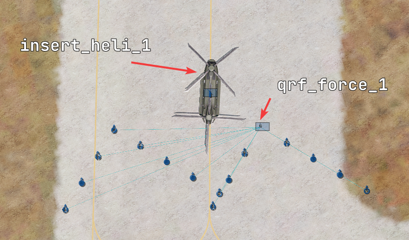
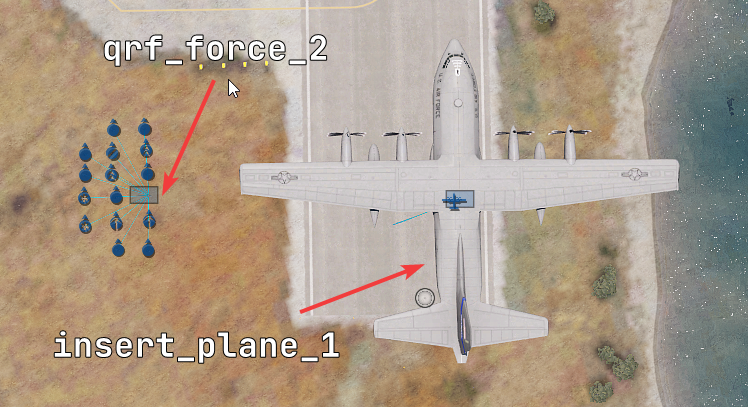
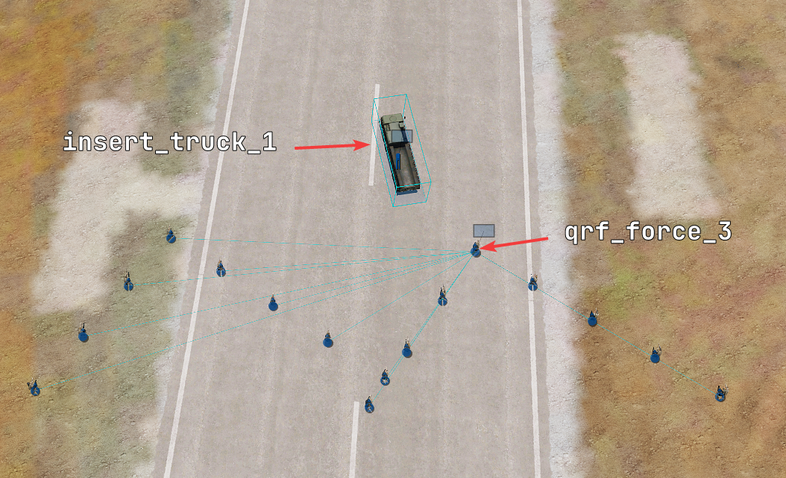
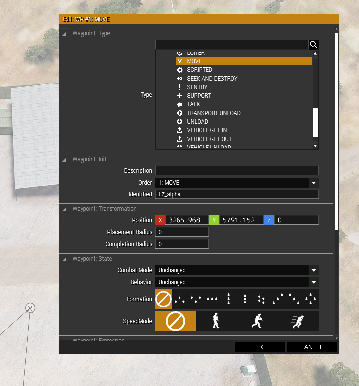

# Timber Corp Reinforcements

Help you set up your reinforcements (QRF) for calling them later. Automatic usage of Murk for performances.

Internally it uses ZEN fast rope and para drop scripts. _WARNING Para drop is not accurate._
# Dependencies

- [CBA](https://github.com/CBATeam/CBA_A3)
- [ACE](https://github.com/acemod/ACE3)
- [ZEN](https://github.com/zen-mod/ZEN)
- [MC framework](https://www.misfit-company.com/arma3/mission_making/framework/) (for Murk) >=v0.3.4

# Download and installation

You can download the latest stable release [here](https://github.com/Timber-Corp-PMC/arma-reinforcements/releases/latest).

Copy the `reinforcements` folder inside your mission folder.

Load the script functions by adding this to your `description.ext`
```ext
class CfgFunctions {
    #include "reinforcements\CfgFunctions.hpp"
};
```

# Usage

For this example we will add 3 reinforcement groups.

- QRF1 => helicopter insertion by fast rope
- QRF2 => plane insertion by para drop
- QRF3 => simple insertion by truck

## Setup

You will need to have a named **vehicle**, a named infantry group **leader** and a named waypoint for each of your reinforcement.
You can put as many waypoints as you would do normally. Murk remembers waypoint behaviour, combat mode, formation etc ...

**Put your infantry group waypoints as they were starting at the [landing zone waypoint](#landing-zone-waypoint)**.

### Our helicopter group



### Our plane group

**Be mindful some planes will start engine off, so don't forget to place it high in the sky if needed.**



### Our truck group



### Landing zone waypoint

Where you want to drop your infantry group, you will need to add a waypoint with a name beginning with `LZ_`.



## Register

You simply need to call `TimberCorpReinforcements_fnc_registerReinforcement`. I highly suggest calling this server side. (`initServer.sqf` is a good place).

`["_name", _vehicle, _infantryLeader, _options] call TimberCorpReinforcements_fnc_registerReinforcement;`

### Parameters

- `_name` => name of your reinforcement. It's used as an identifier to call them later.
- `_vehicle` => Variable name of your vehicle.
- `_infantryLeader` => Variable name of infantry group **leader**.
- `_options` => optional (default []). Array containing optionals parameters, so you can set only the needed one's.
    - `insertionMethod` => (default 1) 
        
        1 = land
      
        2 = fast rope (ace fast rope need to be enabled if not default to land)
      
        3 = parachute

    - `teleportUnits` => (default false)

      if true, teleport directly the infantry inside the vehicle (suggested for planes)
      
      if false, waypoints will be created to let infantry mount inside the vehicle
### Example

In our case we have this
```sqf
["QRF1", insert_heli_1, qrf_force_1, [["insertionMethod", 2]]] call TimberCorpReinforcements_fnc_registerReinforcement;
["QRF2", insert_plane_1, qrf_force_2, [["insertionMethod", 3], ["teleportUnits", true]]] call TimberCorpReinforcements_fnc_registerReinforcement;
["QRF3", insert_truck_1, qrf_force_3] call TimberCorpReinforcements_fnc_registerReinforcement;
 ```

## Call

To call reinforcement group we will use CBA events.

You need to call a server side event called `TimberCorpReinforcements_callReinforcement` and pass it the name of the reinforcement group you want to call.

`["TimberCorpReinforcements_callReinforcement", ["_name"]] call CBA_fnc_serverEvent;`

You can use this inside a trigger, a scroll wheel action or anywhere that suit your need.

### Parameters

- `_name` => name of your reinforcement. Same as the one used for [registration](#register)

### Example

```sqf
["TimberCorpReinforcements_callReinforcement", ["QRF1"]] call CBA_fnc_serverEvent;
["TimberCorpReinforcements_callReinforcement", ["QRF2"]] call CBA_fnc_serverEvent;
["TimberCorpReinforcements_callReinforcement", ["QRF3"]] call CBA_fnc_serverEvent;
 ```

# License


DO WHAT THE FUCK YOU WANT TO PUBLIC LICENSE Version 2, December 2004

Copyright (C) 2004 Sam Hocevar <sam@hocevar.net>

Everyone is permitted to copy and distribute verbatim or modified copies of this license document, and changing it is
allowed as long as the name is changed.

DO WHAT THE FUCK YOU WANT TO PUBLIC LICENSE

TERMS AND CONDITIONS FOR COPYING, DISTRIBUTION AND MODIFICATION

0. You just DO WHAT THE FUCK YOU WANT TO.